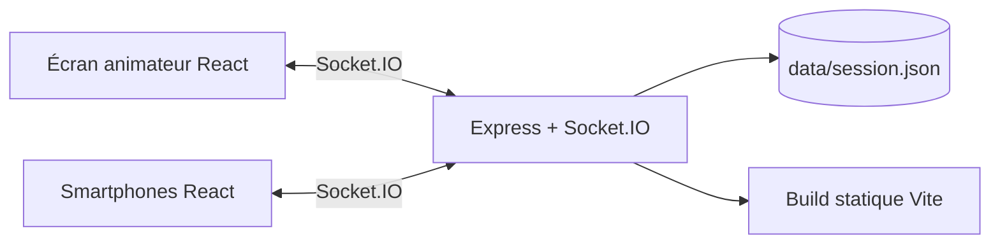

# Pulse

Application de quiz interactif en temps réel pour une présentation en public. L'animateur prépare ses questions, ouvre une salle, partage un code ou un QR code, puis contrôle l'avancement. Les participants répondent depuis leur navigateur sans installation.

## Architecture



- **Client** : React 19, TypeScript, Vite, Recharts, Lucide et QRCode.
- **Serveur** : Node.js, Express et Socket.IO.
- **Validation** : Zod valide chaque quiz côté serveur.
- **Persistance** : une session active est écrite dans `data/session.json`. L'animateur et les participants peuvent donc recharger leur page, et un redémarrage du serveur ne perd pas les réponses.
- **Sécurité** : les commandes d'animation utilisent un jeton aléatoire distinct du code public à six chiffres.

Cette architecture monolithique suffit largement pour 20 à 30 participants et évite une base de données ou un service temps réel supplémentaire. Une seule instance serveur doit être utilisée, car l'état n'est pas partagé entre plusieurs réplicas.

## Préparer, exporter et importer un quiz

Dans `/host`, l'animateur prépare le questionnaire puis peut utiliser :

- **Exporter** pour télécharger le questionnaire courant au format JSON. Le fichier contient le titre, les questions, les réponses et les bonnes réponses ; il ne contient ni session ni résultats.
- **Importer** pour choisir un fichier JSON précédemment exporté. Le fichier est validé avant toute modification : il doit contenir 1 à 50 questions, 2 à 8 réponses par question et au moins une bonne réponse cohérente. Si la validation réussit, il remplace entièrement le questionnaire en cours de préparation.

Ces actions sont indépendantes de **Créer la session** : un export ne bloque donc jamais le lancement du quiz.

## Démarrage local

Prérequis : Node.js 24 ou supérieur.

```bash
npm install
npm run dev
```

- Interface : http://localhost:5173
- Serveur temps réel : http://localhost:3000
- Test de santé : http://localhost:3000/api/health

Le proxy Vite route automatiquement Socket.IO vers le serveur. Pour tester avec un téléphone sur le même réseau, utilisez une URL HTTPS déployée, ou lancez Vite avec `npm run dev:client -- --host` et adaptez le proxy si nécessaire.

## Production

```bash
npm run build
npm start
```

Le serveur Express sert le dossier `dist` et écoute sur `PORT` (3000 par défaut).

### Docker

```bash
docker build -t pulse .
docker run --rm -p 3000:3000 -v pulse-data:/app/data pulse
```

Ouvrez http://localhost:3000.

### Render

Le fichier `render.yaml` permet de créer un Web Service Docker avec un disque persistant. Connectez ce dépôt à Render, choisissez **New Blueprint Instance**, puis gardez une seule instance. Le plan et la région sont à ajuster selon vos contraintes.

Le même conteneur fonctionne sur Railway ou Azure Container Apps. Montez toujours un volume sur `/app/data` si la reprise après redémarrage est nécessaire, et activez les connexions WebSocket.

## Parcours le jour J

1. Ouvrir `/host`, vérifier toutes les questions et créer la session.
2. Projeter la salle d'attente et laisser les participants scanner le QR code.
3. Attendre que le compteur soit stable, puis lancer le quiz.
4. Pour chaque question, observer le graphique en direct, révéler les bonnes réponses, puis avancer.
5. Conserver l'onglet animateur ouvert. Son jeton est stocké dans le navigateur et permet de reprendre la session après un rechargement.

Avant l'événement, faire une répétition sur le réseau réel, vérifier l'accès HTTPS et garder un partage de connexion de secours. Le serveur doit rester sur une seule instance pendant toute la session.

## Commandes de contrôle

```bash
npm run lint
npm run build
```
